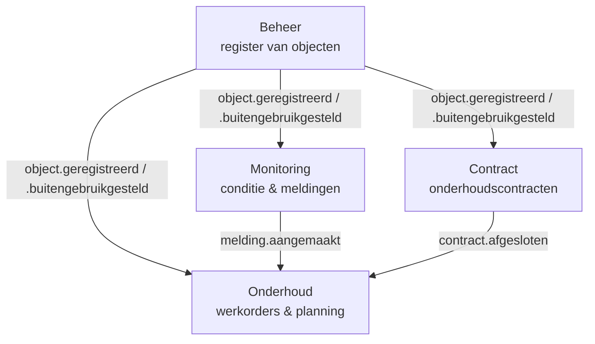

# Context Map

Vier bounded contexts. **Beheer** is de bron van waarheid (upstream); de andere drie
zijn afnemers. Onderstaande relaties zijn een startpunt — verfijn ze samen als de
opdracht daarom vraagt.

## Relaties (Customer/Supplier)

| Upstream (Supplier) | Downstream (Customer) | Wat stroomt er                                             |
|---------------------|-----------------------|------------------------------------------------------------|
| Beheer              | Contract              | Welke objecten bestaan (ObjectId, type, locatie, status)   |
| Beheer              | Monitoring            | Welke objecten gemonitord worden                           |
| Beheer              | Onderhoud             | Welke objecten onderhoud kunnen krijgen                    |
| Monitoring          | Onderhoud             | Meldingen die werk kunnen triggeren                        |
| Contract            | Onderhoud             | Welk contract het werk aan een object dekt                 |

- **Beheer** is puur upstream: het is de *source of truth* voor `ObjectId`. Andere
  contexts bewaren geen kopie van beheer-data behalve de ID's waar ze naar verwijzen
  (plus eventueel een lokale read-model-cache).
- **Onderhoud** is de meest downstream context: het reageert op meldingen (Monitoring),
  kijkt welk contract geldt (Contract) en aan welk object gewerkt wordt (Beheer).

## Gedeelde taal (Published Language)
De **event-envelope** in [events.md](events.md) is het contract tussen alle contexts.
Dat is de enige "shared kernel": vorm en betekenis van de events liggen vast, de interne
modellen van elke context zijn vrij.

## Anti-corruption
Elke downstream context vertaalt binnenkomende events/REST-antwoorden aan de rand
(in `infrastructure`) naar zijn eigen domeintaal. Laat externe modellen niet lekken in
je `domain`-laag.
