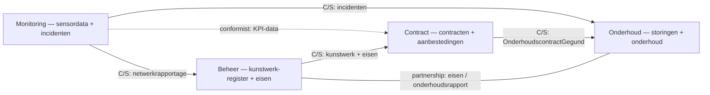

# Context Map

Vier bounded contexts. De relaties hieronder komen uit het **DDD-verslag** (hoofdstuk
_Strategisch niveau_ → context mapping van onderhoud, monitoring en beheer). Dat verslag
is leidend; deze pagina vat het samen.

> **Let op — geen simpele "Beheer upstream, rest downstream".** Uit de context mapping
> blijkt dat de relaties rijker zijn: Beheer en Onderhoud zijn **partners**, Beheer is
> **customer** van Monitoring (voor de netwerkrapportage), en Contract **conformeert**
> zich aan het datamodel van Monitoring. Beheer blijft wél de *bron van waarheid* voor
> het kunstwerk-register (`KunstwerkId`).

## Relaties

| Relatie                       | Type                              | Wat stroomt er                                                        |
|-------------------------------|-----------------------------------|----------------------------------------------------------------------|
| Monitoring → Onderhoud        | Customer/Supplier (O = customer)  | Afwijkingen/incidenten die een inspectie of onderhoud triggeren      |
| Monitoring → Beheer           | Customer/Supplier (B = customer)  | Netwerkrapportage om de (ontwerp)eisen te valideren                  |
| Monitoring → Contract         | Conformist (C conformeert)        | Monitoringsdata voor KPI's en prestatieverklaringen                  |
| Contract → Onderhoud          | Customer/Supplier (O = customer)  | `OnderhoudscontractGegund`: welke aannemer, onder welke voorwaarden  |
| Beheer → Contract             | Customer/Supplier (C = customer)  | Kunstwerkinfo + onderhouds-/ontwerpeisen voor de contracten          |
| Beheer ↔ Onderhoud            | **Partnership**                   | Beheer levert onderhoudseisen; Onderhoud levert het onderhoudsrapport terug en beïnvloedt de eisen |
| Externe aannemers → Onderhoud | Anti-Corruption Layer             | Factuur-/inspectieformats vertaald naar het interne onderhoudsmodel  |
| Externe sensoren → Monitoring | Anti-Corruption Layer             | Externe sensor-/systeemdata vertaald naar het interne monitoringmodel|

- **Beheer** is de *source of truth* voor `KunstwerkId`: andere contexts bewaren geen
  kopie van beheer-data behalve de ID's waarnaar ze verwijzen (plus eventueel een lokale
  read-model-cache). Beheer is echter niet puur upstream — het is customer van Monitoring
  en partner van Onderhoud.
- **Onderhoud** is de meest downstream context: het reageert op incidenten (Monitoring),
  kijkt welk contract geldt (Contract) en werkt binnen de eisen van Beheer.
- **Contract** heeft alleen ID's + eisen van Beheer nodig; het noemt het kunstwerk in
  zijn eigen taal soms "object". Richting Monitoring conformeert het zich aan het
  datamodel voor KPI-/prestatiegegevens.

## Kanttekening uit het verslag
Het "gezamenlijke domein model" in het verslag groepeert Monitoring soms onder
**Beheer / Asset management**. Wij houden Monitoring als een **eigen bounded context**
aan (consistent met de rest van het verslag én met de service-opdeling in deze repo).

## Gedeelde taal (Published Language)
De **event-envelope** in [events.md](events.md) is het contract tussen alle contexts.
Dat is de enige "shared kernel": vorm en betekenis van de events liggen vast, de interne
modellen van elke context zijn vrij.

## Anti-corruption
Elke downstream context vertaalt binnenkomende events/REST-antwoorden aan de rand
(in `infrastructure`) naar zijn eigen domeintaal. Onderhoud en Monitoring hebben hiervoor
expliciet een **Anti-Corruption Layer** naar externe partijen (aannemers, sensoren). Laat
externe modellen niet lekken in je `domain`-laag.
